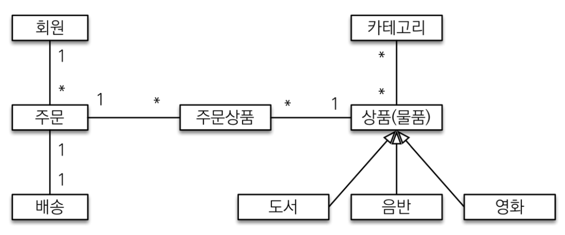

    <h2>실전! 스프링 부트와 JPA 활용</h2>

#### gradle 의존관계 확인법
- 터미널로 이동하여 `./gradlew dependecies`를 입력하면 의존관계가 출력된다.
- slf4j: 로그를 찍는 인터페이스 모음이라고 생각하면 된다.

#### 스프링 부트 thymeleaf viewName 자동 매칭
- 스프링 부트는 templates 폴더 내부의 html파일명을 자동으로 매칭시켜준다.

#### 꿀팁!
- `implementation 'org.springframework.boot:spring-boot-devtools'`를 의존성으로 추가하면 html 파일을 `build -> recompile`만 실행해주면 실시간으로 변화를 볼 수 있다.

#### 도메인 주도 개발
**기능 목록**
- 회원 기능
    - 회원 등록
    - 회원 조회
- 상품 기능
    - 상품 등록
    - 상품 수정
    - 상품 조회
- 주문 기능
    - 상품 주문
    - 주문 내역 조회
    - 주문 취소
- 기타 요구사항
    - 상품은 재고 관리가 필요하다.
    - 상품의 종류는 도서, 음반, 영화가 있다.
    - 상품을 카테고리로 구분할 수 있다.
    - 상품 주문시 배송 정보를 입력할 수 있다.

> 참고: 외래키가 있는 곳을 연관관계의 주인으로 정해라 
> 외래키가 없는 곳을 주인으로 정하면, 외래키 값이 업데이트 되면서 관리와 유지보수가 어렵고, 추가적으로 별도의 업데이트 쿼리가 발생하는 성능 문제도 있다.

#### 엔티티 개발
- 실무에서는 Setter는 꼭 필요한 경우에만 사용하는 것을 추천한다.
- Setter를 막 열어두면 가까운 미래에 인티티가 왜 변경되는지 추적하기가 힘들어진다.
- 따라서 엔티티를 변경할 때는 Setter 대신에 변경 지점이 명확하도록 변경을 위한 비즈니스 메서드를 별도로 제공해야 한다.

#### 엔티티 설계시 주의점
- 엔티티에는 가급적 setter를 사용하지 말자
- 모든 연관관계는 지연로딩으로 설정
  - 즉시로딩은 예측이 어렵고 어떤 SQL이 실행될지 추적하기 어렵다.
  - 실무에서 모든 연관관계는 지연로딩으로 설정해야 한다.
  - JPQL을 실행할 때 N+1문제가 자주 발생한다.
- 컬렉션은 필드에서 초기화하자
  - null문제에서 안전하다
  - 하이버네이트는 엔티티를 영속화할 때 컬렉션을 감싸서 하이버네이트가 제공하는 내장 컬렉션으로 변경한다.
- 테이블 칼럼명 생성 전략

#### 단위 테스트
- test와 main의 설정 파일을 구분해서 작동시킬 수 있다.
- 따라서 ApplicationContext.yml파일을 test에도 따로 두고 실행시키는 것이 좋다.
- 이때 DB에 실제로 연결하는 것은 별로 권장하지 않는다. 
- Mock객체를 사용하여 테스트를 하면 된다.
- 하지만 스프링 부트는 가짜 메모리 DB를 제공해주기 때문에 따로 설정할 것이 없다.

#### 도메인 모델 패턴
- 주문 서비스의 주문과 주문 취소 메서드를 보면 비즈니스 로직 대부분이 엔티티에 있다.
- 서비스 계층은 단순히 엔티티에 필요한 요청을 위임하는 역할을 한다. 
- 이처럼 엔티티가 비즈니스 로직을 가지고 객체 지향의 특성을 적극 활용하는 것을 도메인 모델 패턴이라고 한다.
- 반대로 엔티티에는 비즈니스 로직이 거의 없고 서비스 계층에서 대부분의 비즈니스 로직을 처리하는 것을 드랜잭션 스크립터 패턴이라고 한다.

